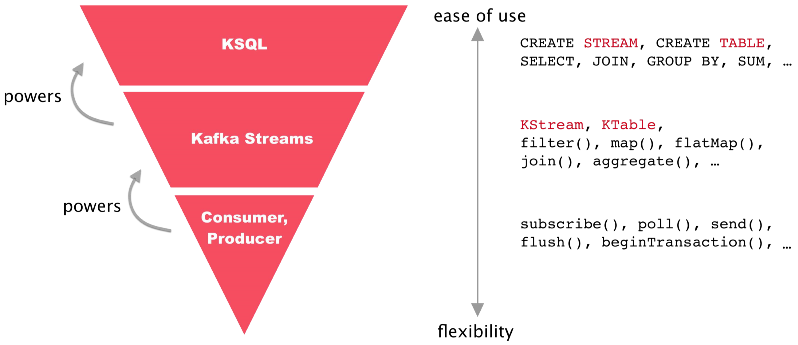

KSQL and Kafka Streams
======================

KSQL is the streaming database for {{ site.aktm }}. With KSQL, you
can write event streaming applications by using a SQL-like query
language.

{{ site.kstreams }} is the {{ site.aktm }} library for writing streaming
applications and microservices in Java and Scala.

KSQL is built on {{ site.kstreams }}, a robust stream processing framework
that is part of Kafka.



KSQL gives you a query layer for building event streaming applications on Kafka
topics. KSQL abstracts away much of the complex programming that's required for
real-time operations on streams of data, so that one line of KSQL can do the
work of a dozen lines of Java or Scala.

For example, to implement simple fraud-detection logic on a Kafka topic
named `payments`, you could write one line of KSQL:

```sql
CREATE STREAM fraudulent_payments AS
 SELECT fraudProbability(data) FROM payments
 WHERE fraudProbability(data) > 0.8
 EMIT CHANGES;
```

The equivalent Scala code on Kafka Streams might resemble:

```scala
// Example fraud-detection logic using the Kafka Streams API.
object FraudFilteringApplication extends App {

  val builder: StreamsBuilder = new StreamsBuilder()
  val fraudulentPayments: KStream[String, Payment] = builder
    .stream[String, Payment]("payments-kafka-topic")
    .filter((_ ,payment) => payment.fraudProbability > 0.8)
  fraudulentPayments.to("fraudulent-payments-topic")

  val config = new java.util.Properties 
  config.put(StreamsConfig.APPLICATION_ID_CONFIG, "fraud-filtering-app")
  config.put(StreamsConfig.BOOTSTRAP_SERVERS_CONFIG, "kafka-broker1:9092")

  val streams: KafkaStreams = new KafkaStreams(builder.build(), config)
  streams.start()
}
```

KSQL is easier to use, and Kafka Streams is more flexible. Which
technology you choose for your real-time streaming applications depends
on a number of considerations. Keep in mind that you can use both KSQL
and Kafka Streams together in your implementations.

Differences Between KSQL and Kafka Streams
------------------------------------------

The following table summarizes some of the differences between KSQL and
Kafka Streams.

| Differences  |      KSQL       |          Kafka Streams           |
| ------------ | --------------- | -------------------------------- |
| You write:   | KSQL statements | JVM applications                 |
| Graphical UI | Yes, in {{ site.c3 }} and {{ site.ccloud }} | No |
| Console      | Yes             | No                               |
| Data formats | Avro, JSON, CSV | Any data format, including Avro, JSON, CSV, Protobuf, XML |
| REST API included | Yes        | No, but you can implement your own  |
| Runtime included  | Yes, the KSQL server | Applications run as standard JVM processes |
| Queryable state   | No         | Yes                              |

Developer Workflows
-------------------

There are different workflows for KSQL and Kafka Streams when you
develop streaming applications.

- KSQL: You write KSQL queries interactively and view the results in
real-time, either in the KSQL CLI or in {{ site.c3 }}. You can save
a .sql file and deploy it to production as a \"headless\"
application, which runs without a GUI, CLI, or REST interface on
KSQL servers.
- Kafka Streams: You write code in Java or Scala, recompile, and run
and test the application in an IDE, like IntelliJ. You deploy the
application to production as a jar file that runs in a Kafka cluster.

KSQL and Kafka Streams: Where to Start?
---------------------------------------

Use the following table to help you decide between KSQL and Kafka
Streams as a starting point for your real-time streaming application
development.


| Start with KSQL when...          | Start with Kafka Streams when...  |
| -------------------------------- | --------------------------------- |
| New to streaming and Kafka       | Prefer writing and deploying JVM applications like Java and Scala; for example, due to people skills, tech environment |
| To quicken and broaden the adoption and value of Kafka in your organization | Use case is not naturally expressible through SQL, for example, finite state machines |
| Prefer an interactive experience with UI and CLI | Building microservices |
| Prefer SQL to writing code in Java or Scala | Must integrate with external services, or use 3rd-party libraries (but KSQL UDFs may help) |
| Use cases include enriching data; joining data sources; filtering, transforming, and masking data; identifying anomalous events | To customize or fine-tune a use case, for example, with the {{ site.kstreams }} Processor API: custom join variants, or probabilistic counting at very large scale with Count-Min Sketch |
| Use case is naturally expressible by using SQL, with optional help from User Defined Functions (UDFs) | Need queryable state, which KSQL doesn't support |
|  Want the power of {{ site.kstreams }} but you aren't on the JVM: use the KSQL REST API from Python, Go, C#, JavaScript, shell | |                  

Usually, KSQL isn't a good fit for BI reports, ad-hoc querying, or
queries with random access patterns, because it's a continuous query
system on data streams.

To get started with KSQL, try the [KSQL Tutorials and Examples](../tutorials/index.md).

To get started with {{ site.kstreams }}, try the [Streams Quick
Start](https://docs.confluent.io/current/streams/quickstart.html).

Next Steps
----------

-   [Write Streaming Queries Against {{ site.aktm }} Using KSQL](../tutorials/basics-docker.md)
-   [KSQL Developer Guide](../developer-guide/index.md)
-   [Streams Developer
    Guide](https://docs.confluent.io/current/streams/developer-guide/index.html)
