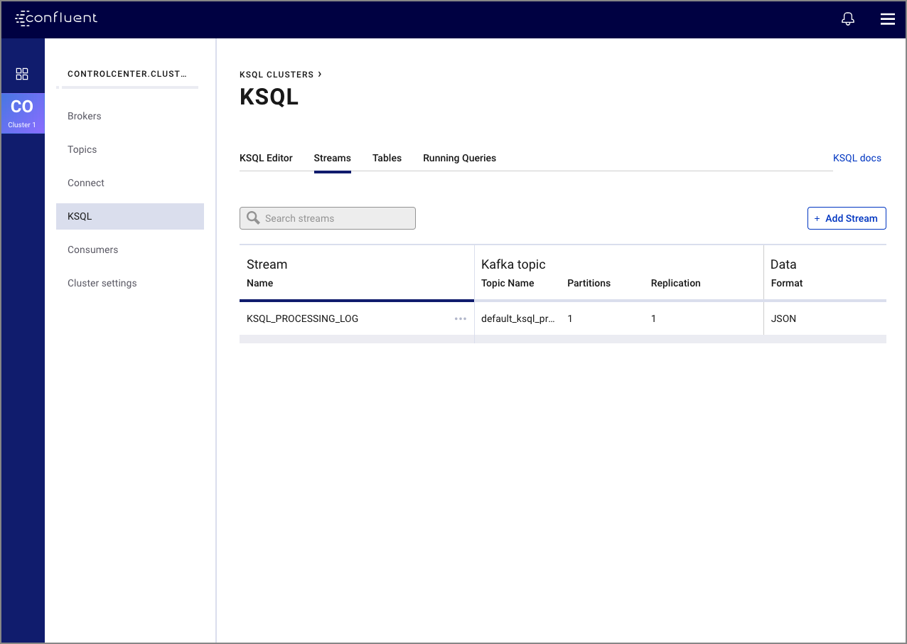

KSQL Tutorials and Examples
===========================

- [Quickstart](ksqldb-quickstart.md)
- [Write Streaming Queries Against {{ site.aktm }} Using KSQL (Docker)](basics-docker.md)
- [Write Streaming Queries Against {{ site.aktm }} Using KSQL (Local)](basics-local.md)
- [Write Streaming Queries Against {{ site.aktm }} Using KSQL and {{ site.c3 }}](basics-control-center.md)
- [Clickstream Data Analysis Pipeline Using KSQL (Docker)](clickstream-docker.md)
- [Generate Custom Test Data by Using the ksql-datagen Tool](generate-custom-test-data.md)
- [Integrating with PostgresDB](connect-integration.md)
- [KSQL Examples](examples.md)

KSQL Basics
-----------

This tutorial demonstrates a simple workflow using KSQL to write
streaming queries against messages in {{ site.aktm }}.

### Write Streaming Queries with the KSQL CLI

```
===========================================
=        _  __ _____  ____  _             =
=       | |/ // ____|/ __ \| |            =
=       | ' /| (___ | |  | | |            =
=       |  <  \___ \| |  | | |            =
=       | . \ ____) | |__| | |____        =
=       |_|\_\_____/ \___\_\______|       =
=                                         =
=  Streaming SQL Engine for Apache Kafka® =
===========================================

Copyright 2019 Confluent Inc.

CLI v{{ site.release }}, Server v{{ site.release }} located at
<http://localhost:8088>

Having trouble? Type 'help' (case-insensitive) for a rundown of how
things work!

ksql>
```

Get started with the KSQL CLI:

- [Write Streaming Queries Against {{ site.aktm }} Using KSQL (Docker)](basics-docker.md)
- [Write Streaming Queries Against {{ site.aktm }} Using KSQL (Local)](basics-local.md)

Write Streaming Queries with KSQL and Confluent Control Center
--------------------------------------------------------------

{width="600px"}

Get started with KSQL and {{ site.c3 }}:

-   {{ site.c3short }}
    [deployed with Docker](https://docs.confluent.io/current/quickstart/ce-docker-quickstart.html)
-   {{ site.c3short }}
    [deployed locally](https://docs.confluent.io/current/quickstart/ce-quickstart.html)

Stream Processing Cookbook
--------------------------

The [Stream Processing Cookbook](https://www.confluent.io/product/ksql/stream-processing-cookbook)
contains KSQL recipes that provide in-depth tutorials and recommended
deployment scenarios.

Clickstream Data Analysis Pipeline
----------------------------------

Clickstream analysis is the process of collecting, analyzing, and
reporting aggregate data about which pages a website visitor visits and
in what order. The path the visitor takes though a website is called the
clickstream.

This tutorial focuses on building real-time analytics of users to
determine:

-   General website analytics, such as hit count and visitors
-   Bandwidth use
-   Mapping user-IP addresses to actual users and their location
-   Detection of high-bandwidth user sessions
-   Error-code occurrence and enrichment
-   Sessionization to track user-sessions and understand behavior (such
    as per-user-session-bandwidth, per-user-session-hits etc)

The tutorial uses standard streaming functions (i.e., min, max, etc) and
enrichment using child tables, stream-table join, and different types of
windowing functionality.

Get started now with these instructions:

-   [Clickstream Data Analysis Pipeline Using KSQL (Docker)](clickstream-docker.md)

If you don't have Docker, you can also run an
[automated version](https://github.com/confluentinc/examples/tree/master/clickstream)
of the Clickstream tutorial designed for local {{ site.cp }}
installs. Running the Clickstream demo locally without Docker requires
that you have {{ site.cp }} installed locally, along with
Elasticsearch and Grafana.

KSQL Examples
-------------

[These examples](examples.md) provide common KSQL usage operations.

You can configure Java streams applications to deserialize and ingest
data in multiple ways, including {{ site.ak }} console producers, JDBC
source connectors, and Java client producers. For full code examples,

KSQL in a Kafka Streaming ETL
-----------------------------

To learn how to deploy a Kafka streaming ETL using KSQL for stream
processing, you can run the [Confluent Platform
demo](https://docs.confluent.io/current/tutorials/cp-demo/docs/index.html).
All components in the {{ site.cp }} demo have encryption,
authentication, and authorization configured end-to-end.

Level Up Your KSQL Videos
-------------------------

|                                           Video                                            |                                                                                                  Description                                                                                                   |
| ------------------------------------------------------------------------------------------ | -------------------------------------------------------------------------------------------------------------------------------------------------------------------------------------------------------------- |
| [KSQL Introduction](https://www.youtube.com/embed/C-rUyWmRJSQ)                             | Intro to Kafka stream processing, with a focus on KSQL.                                                                                                                                                        |
| [KSQL Use Cases](https://www.youtube.com/embed/euz0isNG1SQ)                                | Describes several KSQL uses cases, like data exploration, arbitrary filtering, streaming ETL, anomaly detection, and real-time monitoring.                                                                     |
| [KSQL and Core Kafka](https://www.youtube.com/embed/-GpbMAK3Uow)                           | Describes KSQL dependency on core Kafka, relating KSQL to clients, and describes how KSQL uses Kafka topics.                                                                                                   |
| [Installing and Running KSQL](https://www.youtube.com/embed/icwHpPm-TCA)                   | How to get KSQL, configure and start the KSQL server, and syntax basics.                                                                                                                                       |
| [KSQL Streams and Tables](https://www.youtube.com/embed/DPGn-j7yD68)                       | Explains the difference between a STREAM and TABLE, shows a detailed example, and explains how streaming queries are unbounded.                                                                                |
| [Reading Kafka Data from KSQL](https://www.youtube.com/embed/EzVZOUt9JsU)                  | How to explore Kafka topic data, create a STREAM or TABLE from a Kafka topic, identify fields. Also explains metadata like ROWTIME and TIMESTAMP, and covers different formats like Avro, JSON, and Delimited. |
| [Streaming and Unbounded Data in KSQL](https://www.youtube.com/embed/4ccg1AFeNB0)          | More detail on streaming queries, how to read topics from the beginning, the differences between persistent and non-persistent queries, how do streaming queries end.                                          |
| [Enriching data with KSQL](https://www.youtube.com/embed/9_Gwe6qJrjI)                      | Scalar functions, changing field types, filtering data, merging data with JOIN, and rekeying streams.                                                                                                          |
| [Aggregations in KSQL](https://www.youtube.com/embed/db5SsmNvej4)                          | How to aggregate data with KSQL, different types of aggregate functions like COUNT, SUM, MAX, MIN, TOPK, etc, and windowing and late-arriving data.                                                            |
| [Taking KSQL to Production](https://www.youtube.com/embed/f3wV8W_zjwE)                     | How to use KSQL in streaming ETL pipelines, scale query processing, isolate workloads, and secure your entire deployment.                                                                                      |
| [Insert Into](https://www.youtube.com/watch?v=z508VDdtp_M)                                 | A brief tutorial on how to use INSERT INTO in KSQL by Confluent.                                                                                                                                               |
| [Struct (Nested Data)](https://www.youtube.com/watch?v=TQd5rfFmbhw)                        | A brief tutorial on how to use STRUCT in KSQL by Confluent.                                                                                                                                                    |
| [Stream-Stream Joins](https://www.youtube.com/watch?v=51yLu5FnPYo)                         | A short tutorial on stream-stream joins in KSQL by Confluent.                                                                                                                                                  |
| [Table-Table Joins](https://www.youtube.com/watch?v=-eMXWeBfK7U)                           | A short tutorial on table-table joins in KSQL by Confluent.                                                                                                                                                    |
| [Monitoring KSQL in Confluent Control Center](https://www.youtube.com/watch?v=3o7MzCri4e4) | Monitor performance and end-to-end message delivery of your KSQL queries.                                                                                                                                      |

Page last revised on: {{ git_revision_date }}
